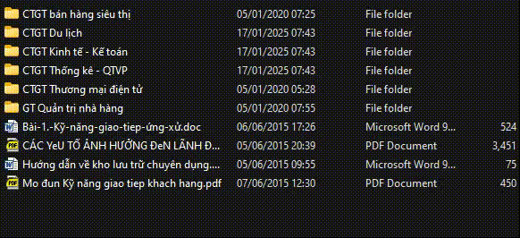

# RenameTVkhongdau_2level

Đổi tên tiếng Việt có dấu sang không dấu với 2 mức độ: Thư mục hiện hành và Thư mục con

------------

Rename files and folders from accented Vietnamese to unaccented Vietnamese in the current directory and its subdirectories.
